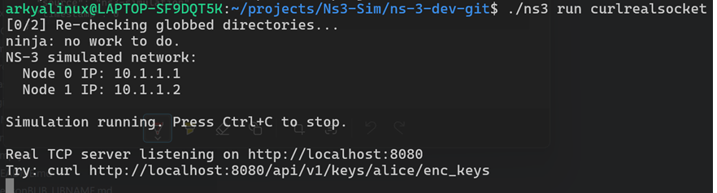
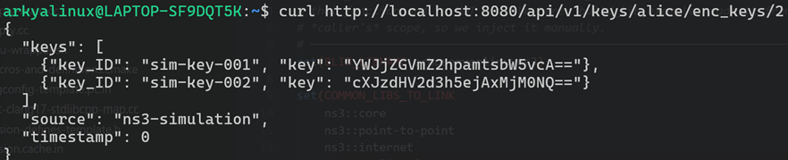

# ns-3 QKD Socket Integration (`echoserverlinuxns3`)

**A work-in-progress ns-3 contrib module that bridges QKDNetSim-derived key material into a custom ns-3 socket path, using a KME (Key Management Entity) buffer as the key source for encrypting simulated network traffic.**

> ⚠️ **Project status: active development, not production-ready.** The module name and some scaffolding files are legacy from an earlier "echo server" scope and are being repurposed/refactored as the project evolves toward QKD-authenticated sockets. Expect breaking changes, dead code paths, and incomplete build configuration.

---

## Overview

Standard ns-3 simulations model network topologies and protocol stacks in isolation from real-world cryptographic infrastructure. This project explores what it takes to close that gap for **Quantum Key Distribution (QKD)** research by:

1. Standing up an ns-3 contrib module with a working CMake build pipeline (`build_lib` / `build_lib_example`) so simulation code, an external `fmt`-based logging/formatting layer, and example binaries can be built and iterated on independently.
2. Emulating a **KME buffer endpoint** (in the style of the ETSI GS QKD 014 `enc_keys` REST API) using a real POSIX TCP socket that runs *alongside* the ns-3 event scheduler via `ns3::RealtimeSimulatorImpl`, so simulated nodes and external tools (e.g. `curl`) can both interact with it during a live simulation run.
3. Working toward pulling key material derived from **QKDNetSim** and feeding it into a custom ns-3 socket implementation, so simulated traffic between nodes can be encrypted using keys sourced the same way a real QKD-secured link would source them, rather than static/simulated placeholders.

The end goal is a reusable ns-3 contrib module where application traffic between simulated nodes can request and consume QKD key material through a KME-like interface, instead of relying on ns-3's built-in (non-QKD-aware) socket/crypto primitives.

## Current State

| Component | Status |
|---|---|
| ns-3 contrib module build system (CPM, `build_lib`, `build_lib_example`) | ✅ Working |
| `fmt` integration for structured logging | ✅ Working |
| Baseline ns-3 point-to-point / UDP echo example (`Ns3Code.cpp`) | ✅ Working — used as a build/topology sanity check |
| Real TCP socket server bridging into a live ns-3 realtime simulation, serving mock KME-style `enc_keys` JSON (`curlrealsocket.cpp`) | ✅ Working prototype |
| TAP bridge experiment for bridging a real Linux interface into a simulated node (`curl-tap-emulation.cpp`) | 🚧 Disabled/commented out — not stable on current dev environment |
| QKDNetSim key retrieval → custom ns-3 socket integration | 🚧 In progress |
| Legacy `echoserverlinuxns3` module/library naming | 🧹 Scheduled for rename during refactor |
| Automated tests | ❌ Not yet added |

## Architecture (current prototype)

```
                  ┌───────────────────────────────────────────┐
                  │              ns-3 Realtime Simulation       │
                  │                                             │
   curl / client  │   Node 0 ───(P2P, 10.1.1.0/24)──── Node 1   │
   ───────────────┼──►                                          │
   HTTP GET        │                                             │
   /api/v1/keys/.. │        Real POSIX TCP socket thread         │
                  │        (mock KME buffer, JSON key payload)  │
                  └───────────────────────────────────────────┘
                                     │
                                     ▼
                     (target) QKDNetSim key source integration
                     → keys consumed by a custom ns-3 socket
                       implementation for encrypting simulated
                       application traffic
```

`RealtimeSimulatorImpl` keeps the ns-3 event clock synchronized with wall-clock time, which is what allows an external process (`curl`) to talk to a socket server running inside the same process as the simulator while the simulation is executing.

## Repository Layout

```
echoserverlinuxns3/
├── CMakeLists.txt              # Registers the module as an ns-3 contrib build_lib target
├── app/                        # Standalone app scaffold (fmt-linked executable)
│   ├── CMakeLists.txt
│   └── main.cpp
├── cmake/                      # Build-system helpers
│   ├── CPM.cmake                # C++ package manager used to pull fmt
│   ├── AddGitSubmodule.cmake
│   ├── ConfigSafeGuards.cmake
│   ├── LTO.cmake
│   ├── Sanitizer.cmake
│   ├── Warnings.cmake
│   └── toolchains/
├── tasks/                       # ns-3 example/prototype binaries
│   ├── CMakeLists.txt
│   ├── Ns3Code.cpp              # Baseline P2P + UDP echo sanity-check topology
│   ├── TcpPortAccess.cpp        # fmt smoke test
│   ├── curlrealsocket.cpp       # Realtime sim + real TCP socket serving mock KME keys
│   └── curl-tap-emulation.cpp   # TAP bridge experiment (currently disabled)
├── src/                         # Reserved for module sources as they're extracted from tasks/
├── external/                    # Reserved for external/vendored dependencies
├── empty.cc / empty.h           # Placeholder translation unit for the contrib module target
└── images/                      # Reference screenshots (see below)
```

## Building

This is an **ns-3 contrib module**, not a standalone CMake project — it depends on ns-3's own build system (`build_lib` / `build_lib_example` macros) and will not configure outside of an ns-3 source tree.

1. Clone [ns-3](https://gitlab.com/nsnam/ns-3-dev) and confirm it builds standalone first.
2. Clone this repository into `contrib/`:
   ```bash
   cd ns-3-dev/contrib
   git clone https://github.com/Arkya212/echoserverlinuxns3.git
   ```
3. Re-run ns-3's configure/build from the ns-3 root so it picks up the new contrib module:
   ```bash
   ./ns3 configure --enable-examples
   ./ns3 build
   ```
4. Run the realtime socket prototype (requires elevated privileges/capabilities on some systems for `RealtimeSimulatorImpl`):
   ```bash
   ./ns3 run curlrealsocket
   ```
   Then, from another terminal:
   ```bash
   curl http://localhost:8080/api/v1/keys/alice/enc_keys
   ```
5. Run the baseline topology sanity check:
   ```bash
   ./ns3 run ns3_echo_server_example
   ```

Dependencies (`fmt`) are pulled automatically via [CPM.cmake](cmake/CPM.cmake); no manual dependency installation is required beyond a working ns-3 toolchain (CMake ≥ 3.28, a C++20-capable compiler).

## Screenshots

**ns-3 realtime simulation bringing up the point-to-point topology and starting the socket server:**



**`curl` querying the running simulation's KME-style key endpoint and receiving a JSON key payload:**



## Design Notes / Rationale

- **Why a real socket inside `ns-3`?** Standard ns-3 applications only exchange packets with other simulated nodes. To emulate a KME buffer, the simulation needs a socket endpoint reachable from *outside* the simulation process while the simulator clock is still advancing — hence `RealtimeSimulatorImpl` plus a POSIX socket run on its own thread.
- **Why CPM for `fmt`?** Keeps the formatting/logging dependency declarative and reproducible without vendoring source, and avoids fighting ns-3's own module system for an unrelated third-party library.
- **Why is `BLIB_LIBNAME` set explicitly in `tasks/CMakeLists.txt`?** `build_lib()` sets it as a variable scoped to the calling CMake function, so it isn't visible to `build_lib_example()` calls in a different directory scope without being re-declared. This is called out in the CMake as a known ns-3 build-system quirk rather than a bug in this module.

## Known Issues / Refactoring TODO

- [ ] Rename the module/library away from the `echoserverlinuxns3` placeholder name once the QKD socket API stabilizes.
- [ ] Move working logic out of `tasks/` (example/prototype scripts) and into `src/` as a proper reusable module.
- [ ] Replace the mock JSON key payload in `curlrealsocket.cpp` with an actual QKDNetSim-sourced key retrieval path.
- [ ] Re-enable and debug the TAP bridge path (`curl-tap-emulation.cpp`) or remove it if the realtime-socket approach fully supersedes it.
- [ ] Add unit/integration tests around the KME buffer client and key-consumption logic.
- [ ] Document the target ns-3 and QKDNetSim versions this module is validated against.
- [ ] Remove remaining placeholder/scaffolding files (`empty.cc`, `empty.h`, unused `external/`) once real sources land.

## Background Reading

Reference material used while designing the socket/server architecture:

- ETSI GS QKD 014 — Quantum Key Distribution: Protocol and data format of REST-based key delivery API (KME buffer interface this project's mock endpoint is modeled after)
- [ns-3 Realtime Simulator documentation](https://www.nsnam.org/)
- [wrk — HTTP benchmarking tool](https://github.com/wg/wrk)
- HTTP server architecture references used to shape the socket-handling code in `curlrealsocket.cpp`

## License

No license has been declared yet — this repository is currently a personal research/portfolio project and should not be assumed to be reusable without contacting the author.

## Author

**Arkya** — Senior Technical Analyst, Optical Networking. Background in Linux kernel/device driver development and embedded systems, currently extending ns-3 for QKD-aware network simulation research.